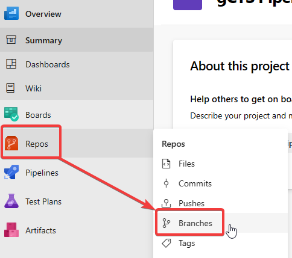
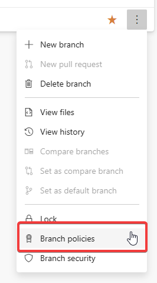
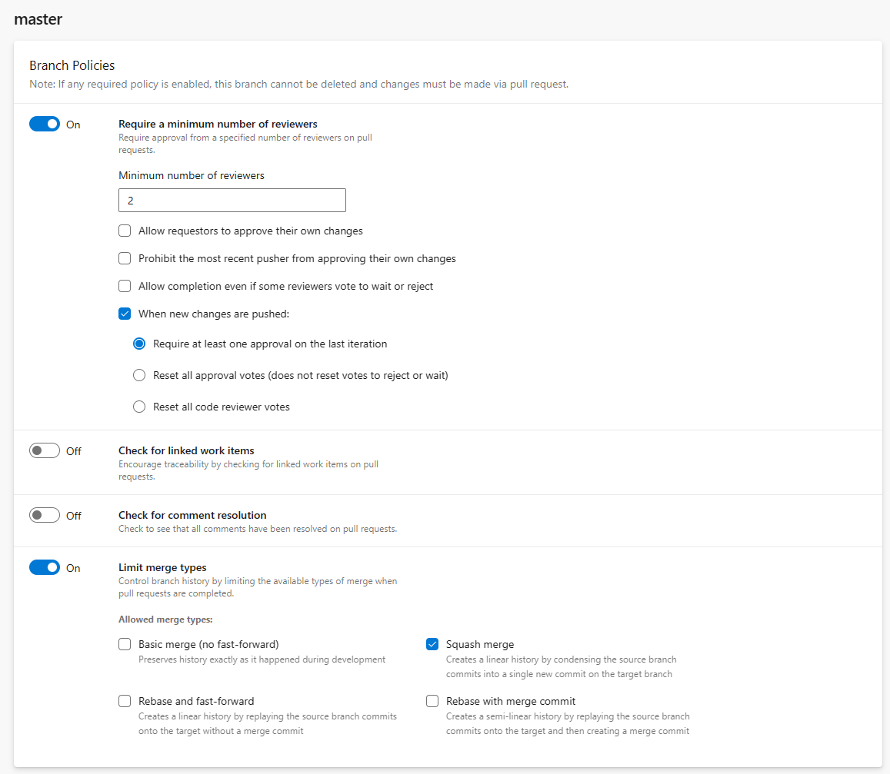
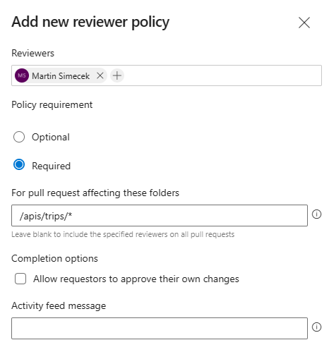

# Challenge 2

This challenge expects participants to use the Azure DevOps user interface and doesn't require touching any code.

## Mandatory reviews for `main` and prevent direct pushes

1. No direct push to `main`
1. At least two reviewers
1. Require code owner's review
1. Commit history not visible in `main` after merging

Go to the project in ADO and under **Repos** select **Branches**.



Hover over the `main` (or `master` for older repos) branch and click the three dots on the right hand side. Select **Branch policies**.



Configure reviewers and merge types according to the challenge goals:



## Code owners per service

1. Define code ownership per API and IaC

Code owners are defined on the same screen as branch policies, in the **Automatically included reviewers** section.

Click the "+" button on the right hand side and create policies for individual APIs and the IaC folder.



Multiple paths can be combined in one rule:

```text
/apis/poi/*;/apis/userprofile/*;/iac/*
```
