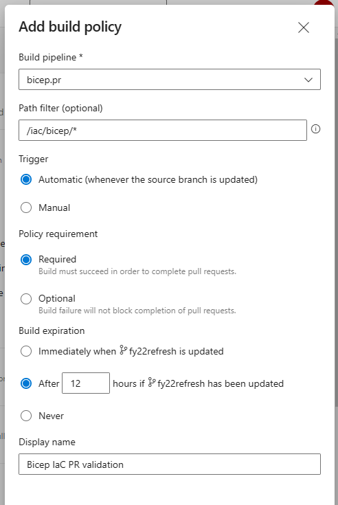
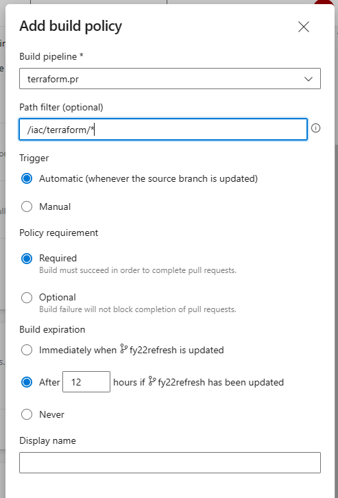

# Challenge 3

This challenge doesn't expect the participants to edit the IoC code or the application. Their task is to build pipelines for automated deployment to Azure.

All pipelines are implemented in the `.azure-pipelines` folder. There are two versions: _Bicep_ and _Terraform_. Each has two flavors: _deploy_ and _pr_.

On the first run, you might be asked to permit access to variable group and service connection. Also, if the pipeline gets stuck in Pending state, check if the lacking permissions are not blocking it.

## Build agents

Due to a recent change in Azure DevOps, it's possible that newly created ADO project [might not get the free grant](https://devblogs.microsoft.com/devops/change-in-azure-pipelines-grant-for-private-projects/) of build minutes. There's a process to request it, but it takes 2-3 business days to review, so start it in advance.

Alternatives:

- Use your Azure Subscription to buy parallel jobs in ADO (`https://dev.azure.com/[organization name]/_settings/billing`).
- Provision a [custom build agent](https://docs.microsoft.com/azure/devops/pipelines/agents/v2-linux?view=azure-devops) in your Azure Subscription with the following tools installed:
    - [pwsh](https://docs.microsoft.com/powershell/scripting/install/installing-powershell-on-linux?view=powershell-7.1) (PowerShell Core)
    - [az](https://docs.microsoft.com/cli/azure/install-azure-cli-linux?pivots=apt) (Azure CLI)
    - [sqlcmd](https://docs.microsoft.com/sql/linux/sql-server-linux-setup-tools?view=sql-server-ver15#ubuntu) (SQL Server tools)
    - unzip
    - jq
    - terraform (if taking the TF route)
    - docker (for future challenges)

## Challenge

There are two kinds of pipelines that need to be built: _validation_ and _deployment_. The validation pipeline should run tests on pull requests, but not deploy anything. The deployment itself is handled by the second pipeline, which would be triggered any time there's a merge into the `main` branch.

Validation:

1. Trigger validation on pull requests.
1. Validate the IaC code with linter.

Deployment:

1. Trigger deployment when changes in IaC are merged into `main`.
1. Before deploying, show a preview of changes.
1. Wait for approval after showing changes.

Azure access has been pre-provisioned in Service Connections (`AzureServiceConnection`) and all necessary values are stored in Variable Groups. The team is not expected to set up any configuration, but they're expected to explore, discover what variables are available and use them in their pipelines.

First step is to create pipelines for validation and deployment. You can look at the solution files for inspiration.

> **Tip:** When creating a pipeline from an existing YAML file, save it first and then rename to something more appropriate.

The key to solving this challenge is to properly configure the triggering branch (`iac/bicep` or `iac/terraform`) and the manual approval step - without it the pipeline will not stop after preview. First of all, an environment called `production` is expected to exist in Azure DevOps.

Then the ADO user interface can be used to configure mandatory PR validation with one of the pipelines.

Go to **Repos -> Branches** and select the `main` branch to configure **Branch policies**:

Click the **+** button next to **Build validation** and create new validation policy.

For Bicep:

For Terraform:

Both created:

Once the policy is configured, it won't be possible to push direcly to `main`, but pull request will be required. To verify that the PR check works properly, create a new branch, make a change in the IaC code, push and create a pull request.

When the pull request gets merged, pipeline trigger (from the pipeline YAML) should kick in and start deployment.

