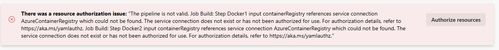

# Challenge 5

1. When there's push to `main`, each of the APIs should have a container image published to Container Registry.
1. Publishing shouldn't be triggered by pull requests.
1. Existing image tag shouldn't be overwritten - a new and unique one should be generated.

This challenge builds on the previous one, so the CI part should be already in place. The team is expected to leverage it to make sure that image is built and pushed to the container registry only when all code tests passed earlier.

There's a sample implementation in the `pipeline.deploy.api.poi.yml` file, which deploys the POI API.

To demonstrate different approaches, this solution leverages the `Docker` task for ADO, unlike GitHub, which used Azure CLI. When trying to use it, you will notice that there's a connection missing:



That's because you need to create an ADO service connection for the Azure Container Registry used for a particular team.

1. Go to **Project settings**.
1. Click **Service connections**.
1. Click **New service connection**.
1. Select **Docker Registry** and click **Next**.
1. Configure a connection for your Azure Container Registry using the options documented [here](https://docs.microsoft.com/azure/devops/pipelines/ecosystems/containers/push-image?view=azure-devops#azure-container-registry) and [here](https://docs.microsoft.com/azure/devops/pipelines/library/service-endpoints?view=azure-devops&tabs=yaml#docker-hub-or-others).
   1. Enter `AzureContainerRegistry` as the **connection name**.
1. Save.

The Docker task uses local Docker installation to build the image and then pushes it into the connected container registry.

> **Note:** When using a self-hosted build agent, make sure that the user account running the ADO service has permissions to work with Docker.
>
> `sudo usermod -a -G docker [user]`

One of the key objectives in this challenge is to use unique tag and don't overwrite an existing one. This is achieved by using the built-in variable `$(Build.BuildId)` which contains the ID of this run.

```yml
- task: Docker@2
  displayName: Build an image
  inputs:
    containerRegistry: $(ContainerRegistryServiceConnectionName)
    repository: $(DOCKER_IMAGE_BASE_NAME)
    command: "build"
    Dockerfile: "$(WORKDIR)/Dockerfile"
    buildContext: "$(WORKDIR)"
    arguments: "--build-arg build_version=$(Build.BuildId)"
    tags: $(Build.BuildId)

- task: Docker@2
  displayName: Push an image
  inputs:
    containerRegistry: $(ContainerRegistryServiceConnectionName)
    repository: $(DOCKER_IMAGE_BASE_NAME)
    command: "push"
    tags: $(Build.BuildId)
```
