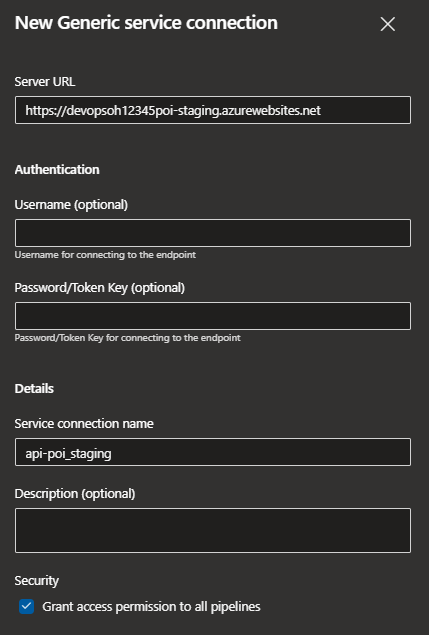
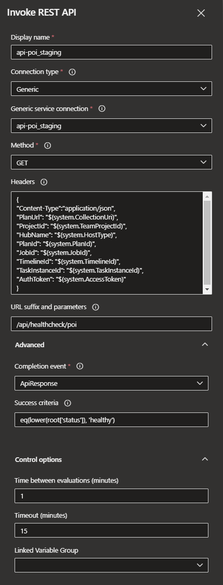

# Challenge 6

This challenge builds on the previous one, so the CD part should be already in place. The team is expected to extend it to make sure that code is pushed to production only if staging deployment and its running succeeds.

Same as in previous exercise there's a sample implementation in the `pipeline.deploy.api.poi.yml`, which deploys the POI API first to a staging slot of the POI web app.

Instead of directly deploying to production the container built is first deployed in a staging slot

```yml
  - stage: Staging
    displayName: "Staging (Blue)"
    jobs:
      - deployment: Staging
        displayName: Staging
        environment: poi-staging
        strategy:
          runOnce:
            deploy:
              steps:
                - task: AzureRmWebAppDeployment@4
                  inputs:
                    ConnectionType: "AzureRM"
                    azureSubscription: "AzureServiceConnection"
                    appType: webAppContainer
                    WebAppName: "$(RESOURCES_PREFIX)$(API_NAME)"
                    deployToSlotOrASE: true
                    ResourceGroupName: "$(RESOURCES_PREFIX)rg"
                    SlotName: staging
                    DockerNamespace: "$(RESOURCES_PREFIX)cr.azurecr.io"
                    DockerRepository: $(DOCKER_IMAGE_BASE_NAME)
                    DockerImageTag: $(Build.BuildId)

                - task: AzureAppServiceManage@0
                  inputs:
                    azureSubscription: "AzureServiceConnection"
                    Action: "Stop Azure App Service"
                    WebAppName: "$(RESOURCES_PREFIX)$(API_NAME)"
                    SpecifySlotOrASE: true
                    ResourceGroupName: "$(RESOURCES_PREFIX)rg"
                    Slot: staging

                - task: AzureAppServiceManage@0
                  inputs:
                    azureSubscription: "AzureServiceConnection"
                    Action: "Start Azure App Service"
                    WebAppName: "$(RESOURCES_PREFIX)$(API_NAME)"
                    SpecifySlotOrASE: true
                    ResourceGroupName: "$(RESOURCES_PREFIX)rg"
                    Slot: staging
```

Then to test whether the staging slot is up and running you will have to:

1. Create a generic service connection to the slot
  
   

2. Create a [Rest Call task](https://docs.microsoft.com/en-us/azure/devops/pipelines/tasks/utility/http-rest-api?view=azure-devops) using that service connection as a gate to move to the production deployment for example

   ```yml
   # Invoke REST API
   # Invoke a REST API as a part of your pipeline.
    - task: InvokeRESTAPI@1
      inputs:
        #connectionType: 'connectedServiceName' # Options: connectedServiceName, connectedServiceNameARM
        #serviceConnection: # Required when connectionType == ConnectedServiceName
        #azureServiceConnection: # Required when connectionType == ConnectedServiceNameARM
        #method: 'POST' # Options: OPTIONS, GET, HEAD, POST, PUT, DELETE, TRACE, PATCH
        #headers: '{Content-Type:application/json, PlanUrl: $(system.CollectionUri), ProjectId: $(system.TeamProjectId), HubName: $(system.HostType), PlanId: $(system.PlanId), JobId: $(system.JobId), TimelineId: $(system.TimelineId), TaskInstanceId: $(system.TaskInstanceId), AuthToken: $(system.AccessToken)}' 
        #body: # Required when method != GET && Method != HEAD
        #urlSuffix: # Optional
        #waitForCompletion: 'false' # Options: true, false
        #successCriteria: # Optional
   ```
  
   

Finally if the above task is successful you would need to swap the staging environment to production by swapping slots of the App Service

```yml
  - stage: Production
    displayName: "Production (Green)"
    jobs:
      - deployment: Production
        displayName: Production
        environment: poi-production
        strategy:
          runOnce:
            deploy:
              steps:
                - task: AzureAppServiceManage@0
                  inputs:
                    azureSubscription: "AzureServiceConnection"
                    Action: "Swap Slots"
                    WebAppName: "$(RESOURCES_PREFIX)$(API_NAME)"
                    ResourceGroupName: "$(RESOURCES_PREFIX)rg"
                    SourceSlot: "staging"
```
