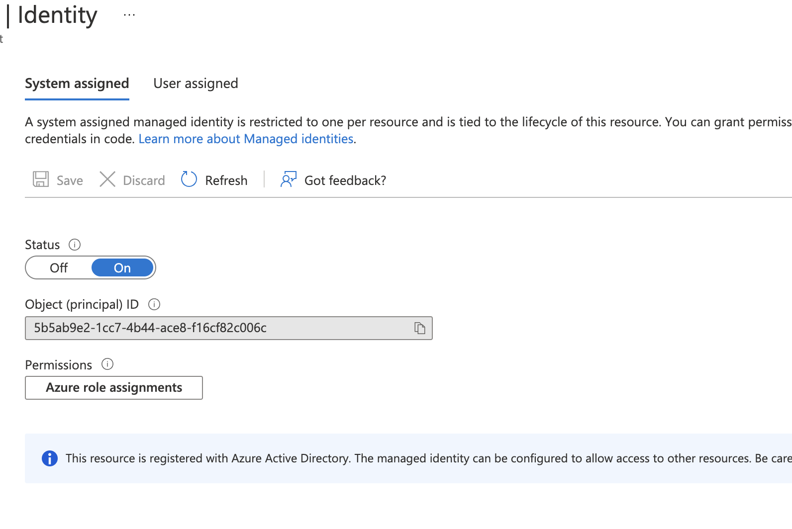
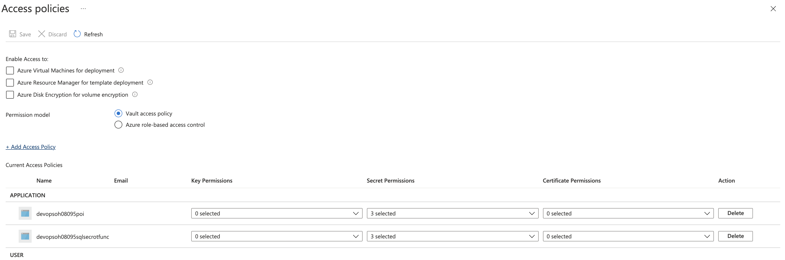
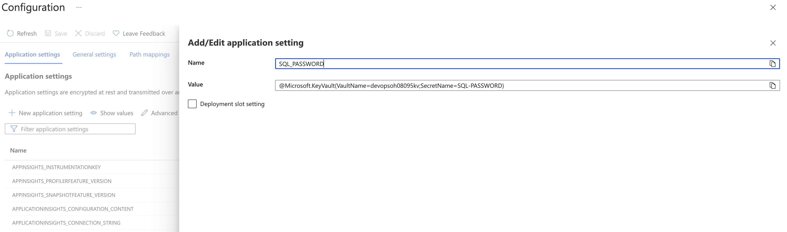
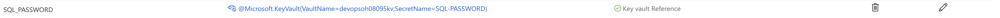
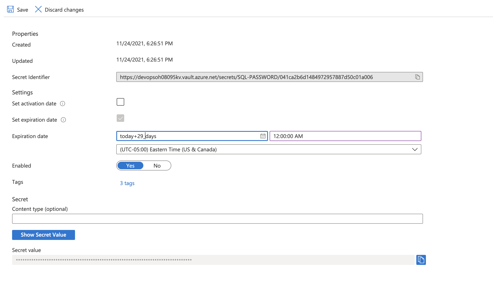
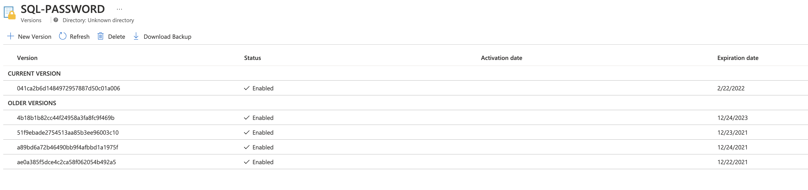

# Challenge 7

## Secrets Scanning

### CredScan

### Gitleaks

## Secret Rotation

The solution for the Secret Rotation will require the team to create a KeyVault with the name {RESOURCES_PREFIX}kv.  

`az keyvault create --name {RESOURCES_PREFIX}kv -g {RESOURCES_PREFIX}rg`  

They will then need to create the ado pipeline to deploy the dependent resources listed below for the rotation to work. The pipeline is located in the team's repo (`support/sqlsecretrotation/.azure-pipelines/pipeline.bicep.sqlsecrot.yml`).

- {RESOURCES_PREFIX}sqlsecrotrg
- {RESOURCES_PREFIX}sqlsecrotst
- {RESOURCES_PREFIX}sqlsecrotplan
- {RESOURCES_PREFIX}sqlsecrotfunc
- {RESOURCES_PREFIX}sqlsecrotappi
- EventGrid System Topic in the {RESOURCES_PREFIX}rg

 Once the Keyvault is created and the supporting services are created using the ado pipline they will need to create the secret and add the tags properly.

`az keyvault secret set --name SQL-PASSWORD --vault-name {RESOURCES_PREFIX}kv --value "demo@pass123" --tags "CredentialId=demousersa" "ProviderAddress={MydrvingDB_Azure_ResourceID}" "ValidityPeriodDays=90"`

Finally configure the poi app service to read the password value from the secret in keyvault with Key Vault references for App Service.

- Enable system assigned identity on the poi app service.

- Add Access Policy in Keyvault {RESOURCES_PREFIX}kv for the system assigned identity for the poi app service.

- Add keyvault reference to the poi app service application settings.
    @Microsoft.KeyVault(VaultName={RESOURCES_PREFIX}kv;SecretName=SQL-PASSWORD)

### Testing

- Set the secret to expire within 29 days of the current date.

- Save the change and wait for the rotation to happen. This may take a few minutes to complete.
- Once the rotation is complete you should see multiple versions of the secret one current and many historical depending on the number of time tested

- Validate the poi/api endpoint for the app service is still service data.
