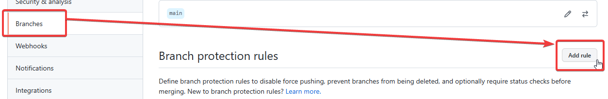
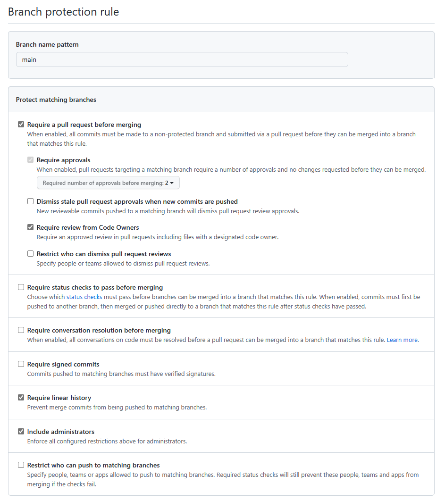
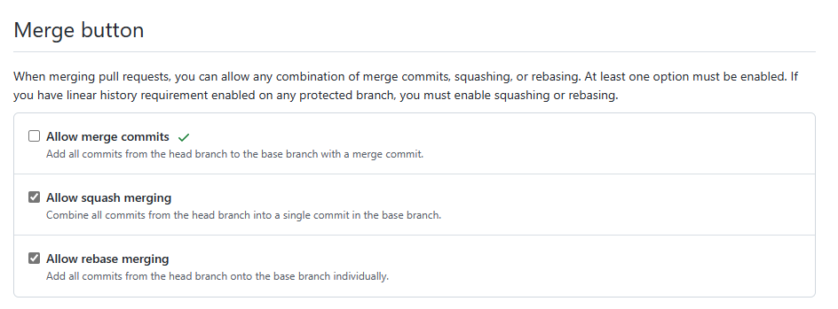

# Challenge 2

This challenge expects participants to use both the GitHub interface and configuration in code to accomplish the goals.

## Mandatory reviews for `main` and prevent direct pushes

1. No direct push to `main`
1. At least two reviewers
1. Require code owner's review
1. Commit history not visible in `main` after merging

Go to the repository within the GitHub organization and click **Settings**.

In **Branches** click **Add rule**.



Enter `main` to the **Branch name pattern** field and set the rule to require pull requests before merging, with 2 approvals and review from Code Owners. Ideally, this should be enforced for administrators too.



This effectively disables the ability to push directly to `main`.

Additionaly, it's possible to change what merge options are available on the repository level (so across all branches) - in the **Settings** screen of the repo, scroll down and see the **Merge button** section:



## Code owners per service

1. Define code ownership per API and IaC

Create a `CODEOWNERS` file in the `.github` folder within repository root.

The contents should specify paths to individual components (individual APIs and IaC) and respective owner accounts.

```text
/apis/poi/ @DariuszPorowski
/apis/trips/ @msimecek
/apis/user-java/ @DariuszPorowski @msimecek
/apis/userprofile/ @DariuszPorowski
/iac/ @DariuszPorowski
```

Usernames have to begin with `@` and multiple users are separated with a space.
