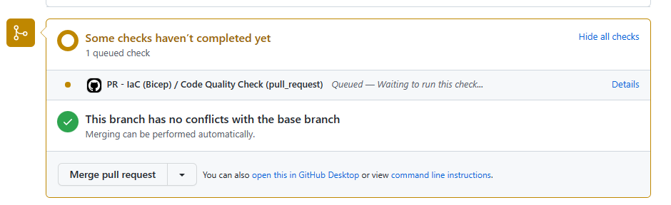
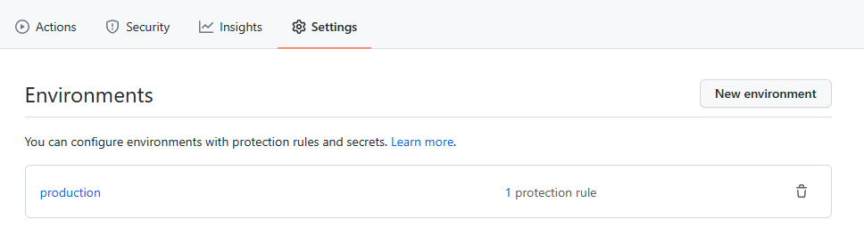
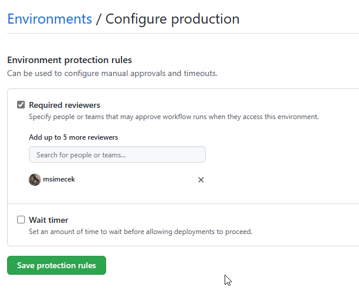
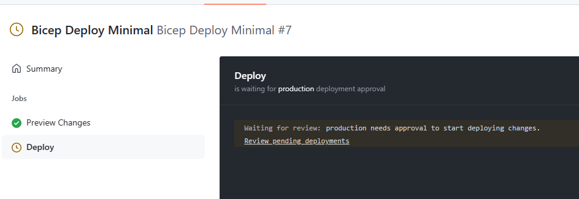
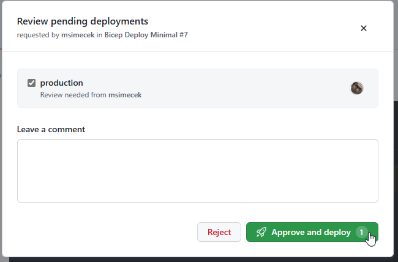

# Challenge 3

This challenge doesn't expect the participants to edit the IaC code or the application. Their task is to build workflows for automated deployment to Azure.

All workflows are implemented in the `.github/workflows` folder. There are two versions: _Bicep_ and _Terraform_. Each has two flavors: _deploy_ and _pr_.

## Challenge

There are two kinds of workflows that need to be built: _validation_ and _deployment_. The validation workflow should run tests on pull requests, but not deploy anything. The deployment itself is handled by the second workflow, which would be triggered any time there's a merge into the `main` branch.

Validation:

1. Trigger validation on pull requests.
1. Validate the IaC code with linter.

Deployment:

1. Trigger deployment when changes in IaC are merged into `main`.
1. Before deploying, show a preview of changes.
1. Wait for approval after showing changes.

The solution is split into two files per chosen technology (Bicep or Terraform):

- `workflow.x.pr.yml` implements the validation part
- `workflow.x.deploy.yml` contains the deployment part

> Ensure that the workflow is using the correct `RESOURCES_PREFIX` value for the team. By default the solution presented here, parses the repository name and uses is as the prefix.

Using the `workflow_dispatch:` trigger enables this workflow to be started manually. That's useful for testing, so that the team doesn't have to make arbitrary code changes just to trigger the workflow.

### PR

The PR trigger in YAML code is set up in a way that the pull request workflow is triggered automatically. Ensure that the branch and paths are correct:

```yaml
on:
  pull_request:
    branches:
      - main
    paths:
      - "iac/bicep/**"
  workflow_dispatch:
```

To test the functionality, create a new branch, push some changes in the IaC files and create a pull request against the `main` branch. After a few seconds, the automated check should trigger:



### Deployment

Merging the pull request should trigger the second pipeline - deployment.

Preview of changes is done by using the `what-if` command of Azure CLI deployment. This step doesn't stop and wait for approval on its own, it only lists what's going to happen during deployment.

In order to complete this challenge, it's necessary to set approvals in deployment environment on GitHub. The solution provided in the `.github/workflows` folder expects to find an environment called `production`.

```yml
deploy:
  name: "Deploy"
  needs: preview
  runs-on: ubuntu-latest
  environment: production
```



Then configure a protection rule - add required reviewers.



When the workflow is started, it will stop after the "Preview Changes" job and wait for confirmation.




