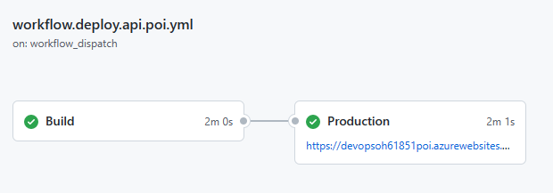

# Challenge 5

1. When there's push to `main`, each of the APIs should have a container image published to Container Registry.
1. Publishing shouldn't be triggered by pull requests.
1. Existing image tag shouldn't be overwritten - a new and unique one should be generated.

This challenge builds on the previous one, so the CI part should be already in place. The team is expected to leverage it to make sure that image is built and pushed to the container registry only when all code tests passed earlier.

There's a sample implementation in the `workflow.deploy.api.poi.yml`, which deploys the POI API.

This solution leverages Azure Container Registry to build Docker images using Azure CLI:

```bash
az acr build
```

One of the success criteria states that the publish process **shouldn't overwrite the existing image tag**. A common practice is to use the ID of the workflow run, which is unique enough to be used as a tag.

```bash
--image ${{ env.DOCKER_IMAGE_BASE_NAME }}:${{ github.run_id }}
```

Using the `environment.url` parameter shows the deployed URL in the workflow overview like this:



Validate that the API was successfully deployed by going to the URL and verifying that the shown version number corresponds with Docker image tag.

## Extended challenge solution (GitHub Packages)

GitHub Packages requires Personal Access Token as well, so first you have to create it with `read:packages` scope (just for pulling images by App Service), and store into Repository or Environment secrets.
More: [About scopes and permissions for package registries](https://docs.github.com/en/packages/learn-github-packages/about-permissions-for-github-packages#about-scopes-and-permissions-for-package-registries)

To you existing deployment workflow for IaC you have to add additional parameters for Container Registry, and run IaC deployment workflow to make changes in application infrastructure configuration:

### Terraform

```bash
-var="docker_registry_server_url=https://ghcr.io" -var="docker_registry_server_username=ghcr" -var="docker_registry_server_password=${{ secrets.GHCR_READ_TOKEN }}"
```

Above part has to be added to `terraform plan` and `terraform apply` steps.

```yaml
- name: Terraform Plan
  run: terraform plan -detailed-exitcode -var="location=${{ secrets.LOCATION }}" -var="resources_prefix=${{ env.RESOURCES_PREFIX }}" -var="docker_registry_server_url=https://ghcr.io" -var="docker_registry_server_username=ghcr" -var="docker_registry_server_password=${{ secrets.GHCR_READ_TOKEN }}" || exit 0
  id: tfplan
```

```yaml
- name: Terraform Apply
  run: terraform apply -auto-approve -var="location=${{ secrets.LOCATION }}" -var="resources_prefix=${{ needs.preview.outputs.RESOURCES_PREFIX }}" -var="docker_registry_server_url=https://ghcr.io" -var="docker_registry_server_username=ghcr" -var="docker_registry_server_password=${{ secrets.GHCR_READ_TOKEN }}"
```

### Bicep

```bash
dockerRegistryServerUrl="https://ghcr.io" dockerRegistryServerUsername="ghcr" dockerRegistryServerPassword="${{ secrets.GHCR_READ_TOKEN }}"
```

Above part has to be added to `az deployment sub what-if` and `az deployment sub create` steps.

```yaml
- name: "What-If"
  uses: Azure/cli@1.0.4
  with:
    inlineScript: |
    az deployment sub what-if \
        --name ${{ github.run_id }} \
        --template-file ${{ env.WORKDIR }}/main.bicep \
        --location "${{ secrets.LOCATION }}" \
        --parameters resourcesPrefix=${{ env.RESOURCES_PREFIX }} dockerRegistryServerUrl="https://ghcr.io" dockerRegistryServerUsername="ghcr" dockerRegistryServerPassword="${{ secrets.GHCR_READ_TOKEN }}"
```

```yaml
- name: "Deployment"
  uses: Azure/cli@1.0.4
  with:
    inlineScript: |
    az deployment sub create \
        --name ${{ github.run_id }} \
        --template-file ${{ env.WORKDIR }}/main.bicep \
        --location "${{ secrets.LOCATION }}" \
        --parameters resourcesPrefix=${{ needs.preview.outputs.RESOURCES_PREFIX }} dockerRegistryServerUrl="https://ghcr.io" dockerRegistryServerUsername="ghcr" dockerRegistryServerPassword="${{ secrets.GHCR_READ_TOKEN }}"
```
