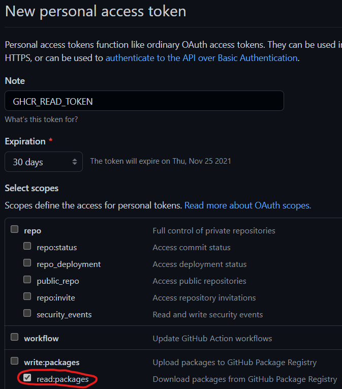
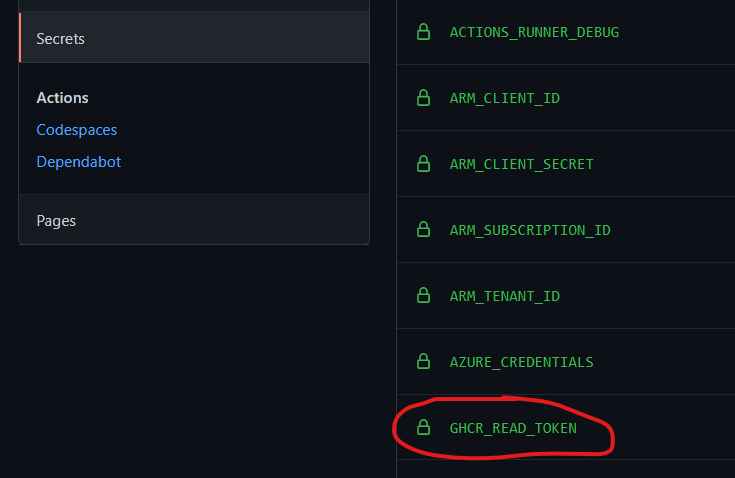

# Challenge 6

This challenge builds on the previous one, so the CD part should be already in place. The team is expected to extend it to make sure that code is pushed to production only if staging deployment and running succeeds.

Same as in previous exercise there's a sample implementation in the `workflow.deploy.api.poi.yml`, which deploys the POI API first to a staging slot of the POI web app.

```yml
  staging:
    name: "Staging (Blue)"
    needs: build
    runs-on: ubuntu-latest
    environment:
      name: poi-staging
      url: "${{ steps.deploy-to-webapp.outputs.webapp-url }}/api/version/${{ env.API_NAME }}"
    env:
      RESOURCES_PREFIX: ${{ needs.build.outputs.RESOURCES_PREFIX }}
      DOCKER_IMAGE_FULL_NAME: "${{ needs.build.outputs.DOCKER_IMAGE_FULL_NAME }}"
    steps:
      # Login to Azure with Service Principal
      - name: "Azure Login"
        uses: Azure/login@v1
        with:
          creds: ${{ secrets.AZURE_CREDENTIALS }}

      - name: Azure WebApp
        id: deploy-to-webapp
        uses: Azure/webapps-deploy@v2
        with:
          app-name: ${{ env.RESOURCES_PREFIX }}${{ env.API_NAME }}
          slot-name: staging
          images: "${{ env.DOCKER_IMAGE_FULL_NAME }}:${{ github.run_id }}"
```

Then there is a task which issues http requests for the given number of times (60) in a 10s interval expecting to get a valid HTTP status code 200 response.

```yml
      - name: Check the deployed service health check
        uses: jtalk/url-health-check-action@v2
        with:
          url: ${{ steps.deploy-to-webapp.outputs.webapp-url }}/api/healthcheck/${{ env.API_NAME }}
          follow-redirect: true
          max-attempts: 60
          retry-delay: 10s
          retry-all: true
```

If the tasks succeeds then it moves to the next task to deploy in production

```yml
  production:
    name: "Production"
    needs: build
    runs-on: ubuntu-latest
    environment:
      name: poi-production
      url: "${{ steps.deploy-to-webapp.outputs.webapp-url }}/api/version/${{ env.API_NAME }}"
    env:
      RESOURCES_PREFIX: ${{ needs.build.outputs.RESOURCES_PREFIX }}
      DOCKER_IMAGE_FULL_NAME: "${{ needs.build.outputs.DOCKER_IMAGE_FULL_NAME }}"
    steps:
      # Login to Azure with Service Principal
      - name: "Azure Login"
        uses: Azure/login@v1
        with:
          creds: ${{ secrets.AZURE_CREDENTIALS }}

      # Set new Docker image in WebApp
      - name: Azure WebApp
        id: deploy-to-webapp
        uses: Azure/webapps-deploy@v2
        with:
          app-name: ${{ env.RESOURCES_PREFIX }}${{ env.API_NAME }}
          images: "${{ env.DOCKER_IMAGE_FULL_NAME }}:${{ github.run_id }}"
```

You can leverage Github packages to deploy your container images (packages) same as in the previous exercise
GitHub Packages requires Personal Access Token as well, so first you have to create it with `read:packages` scope (just for pulling images by App Service), and store into Repository or Environment secrets. More: [About scopes and permissions for package registries](https://docs.github.com/en/packages/learn-github-packages/about-permissions-for-github-packages#about-scopes-and-permissions-for-package-registries)

  
  
and set the generated PAT as a secret with the name to your repository
  

Then replace the build task with the following tasks

```yml
      # GITHUB PACKAGES CONTAINER REGISTRY
      - name: Get docker image full name
        run: |
          # Repository name to lowercase - Docker registries accept only lowercase tag names
          REPOSITORY=${GITHUB_REPOSITORY,,}
          DOCKER_IMAGE_FULL_NAME=ghcr.io/${REPOSITORY}/${{ env.DOCKER_IMAGE_BASE_NAME }}

          # Set for current Job
          echo "DOCKER_IMAGE_FULL_NAME=${DOCKER_IMAGE_FULL_NAME}" >> ${GITHUB_ENV}

          # Set for next Job
          echo "::set-output name=DOCKER_IMAGE_FULL_NAME::${DOCKER_IMAGE_FULL_NAME}"
        id: dockerfullname

      - name: Log in to ghcr.io
        uses: docker/login-action@v1
        with:
          registry: ghcr.io
          username: ${{ github.actor }}
          password: ${{ secrets.GITHUB_TOKEN }}

      - name: Docker Metadata action
        uses: docker/metadata-action@v3
        with:
          images: ${{ env.DOCKER_IMAGE_FULL_NAME }}
          tags: |
            type=raw,value=${{ github.run_id }}
        id: metadata

      - name: Build and push Docker image
        uses: docker/build-push-action@v2
        with:
          context: ${{ env.WORKDIR }}
          file: ${{ env.WORKDIR }}/Dockerfile
          tags: ${{ steps.metadata.outputs.tags }}
          labels: ${{ steps.metadata.outputs.labels }}
          build-args: build_version=${{ github.run_id }}
          push: true
  ```
